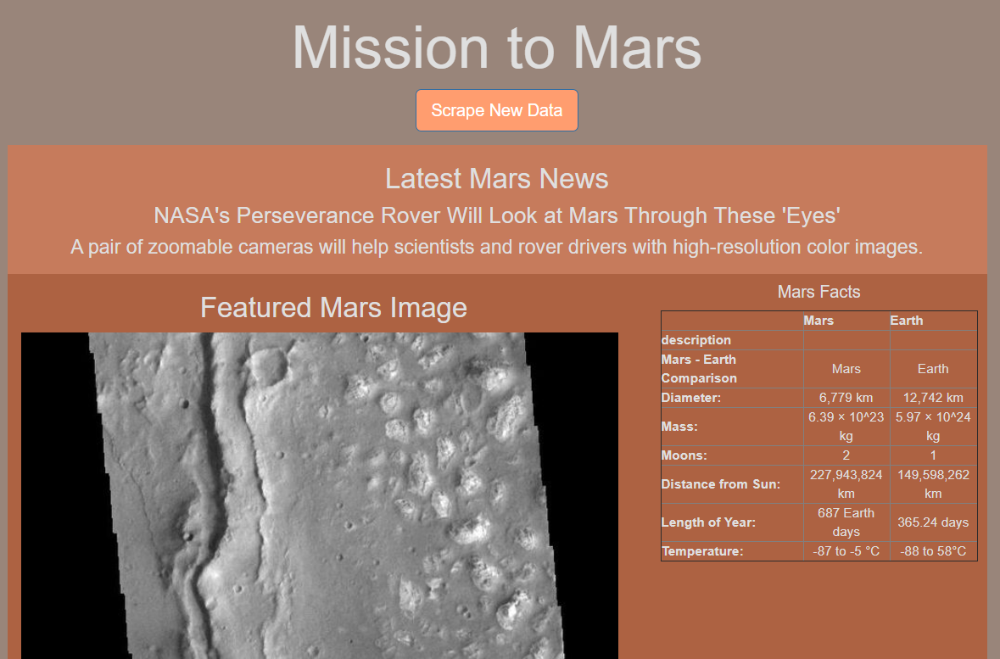

# Mission to Mars

## Project Purpose
Using a simple python script, the goal of this project was to automate a web browser to scrape images and news from various different websites and to display the data concisely using html. First, the program was written in jupyter notebook as a way to test the code line by line. BeautifulSoup and Splinter were both used to automate the web browser and to perform the web scrape. The scraped data was stored in a MongoDB database, and Flask was used to display the data from the database onto a browser page. Finally, HTML/CSS and some Bootstrap components were used to create a presentable web page that showcases in a aesthetic manner.

## Resources
- Software: 
	- BeautifulSoup
	- Splinter
	- Pandas
	- Flask
	- MongoDB
	- HTML/CSS
	- Jupyter Notebook
	- Python 3.7.10
	
### Screenshot example:

